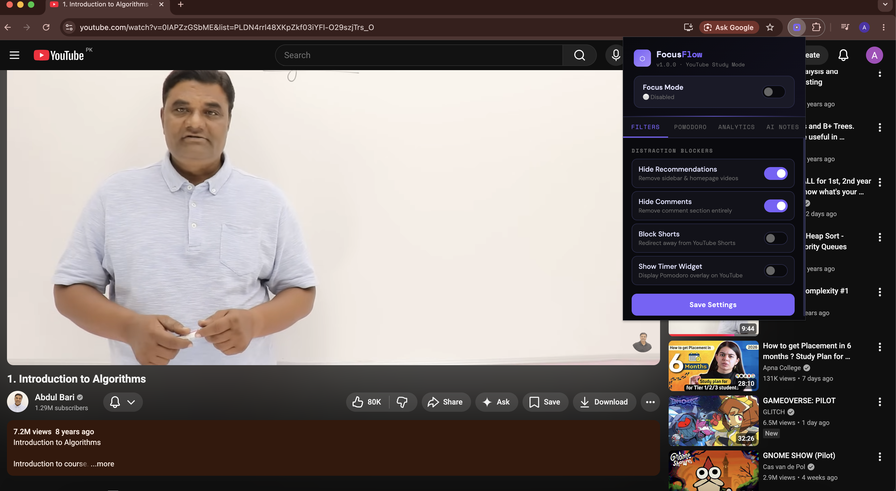
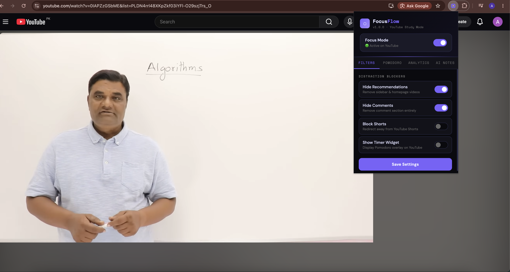
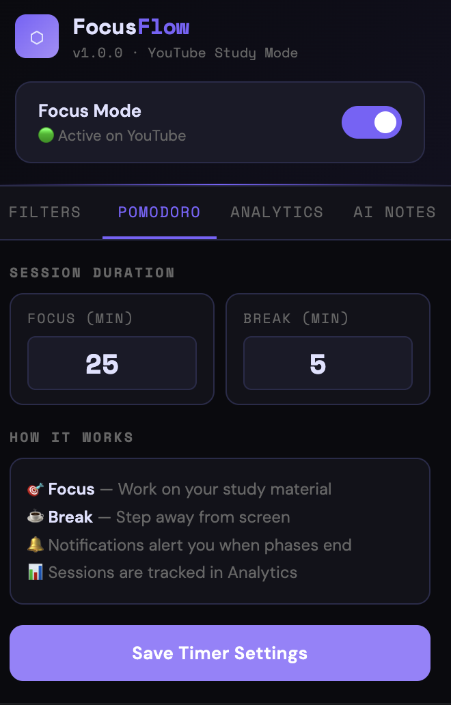
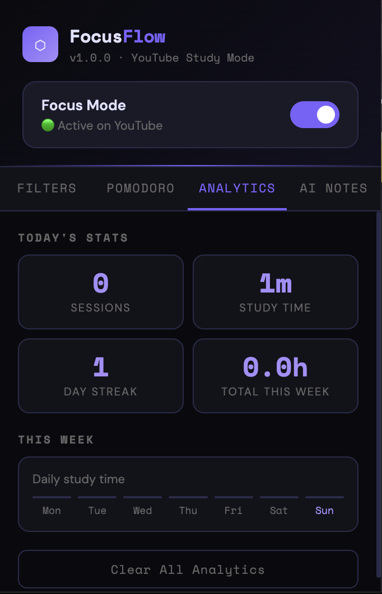
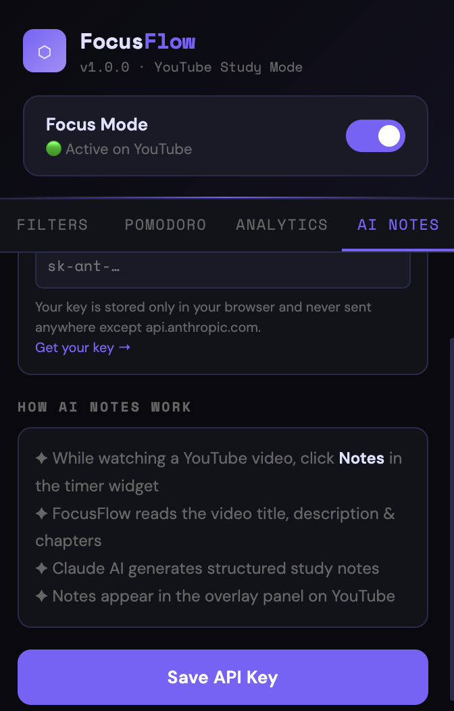

<div align="center">

```
███████╗ ██████╗  ██████╗██╗   ██╗███████╗███████╗██╗      ██████╗ ██╗    ██╗
██╔════╝██╔═══██╗██╔════╝██║   ██║██╔════╝██╔════╝██║     ██╔═══██╗██║    ██║
█████╗  ██║   ██║██║     ██║   ██║███████╗█████╗  ██║     ██║   ██║██║ █╗ ██║
██╔══╝  ██║   ██║██║     ██║   ██║╚════██║██╔══╝  ██║     ██║   ██║██║███╗██║
██║     ╚██████╔╝╚██████╗╚██████╔╝███████║██║     ███████╗╚██████╔╝╚███╔███╔╝
╚═╝      ╚═════╝  ╚═════╝ ╚═════╝ ╚══════╝╚═╝     ╚══════╝ ╚═════╝  ╚══╝╚══╝
```

**Transform YouTube into your personal study sanctuary.**

[](https://github.com)
[](https://developer.chrome.com/docs/extensions/mv3/)
[](LICENSE)
[]()
[](https://anthropic.com)

<br/>

> *"I built this because I kept opening YouTube to learn and ended up watching cat videos for 3 hours."*

<br/>

</div>

---

## ⬡ What is FocusFlow?

**FocusFlow** is a Chrome extension that surgically removes every distraction from YouTube — recommendations, comments, Shorts — while adding a Pomodoro timer, study analytics, and AI-generated video notes powered by Claude AI.

It's built entirely with vanilla JavaScript, pure CSS, and Chrome's Manifest V3 APIs. No frameworks. No build tools. No dependencies. Just raw, working code.

---

## ✦ Features

### 🚫 Distraction Blockers
| Feature | What it does |
|---|---|
| **Hide Recommendations** | Removes the sidebar, homepage feed, and all "watch next" suggestions |
| **Hide Comments** | Collapses the entire comments section |
| **Block Shorts** | Intercepts navigation to `/shorts` and shows a study reminder screen |
| **Clean UI** | Expands the video player when the sidebar is hidden |

### ⏱ Pomodoro Timer
- Floating, **draggable** timer widget overlaid on YouTube
- Configurable **Focus** and **Break** durations
- Visual progress bar that changes color between phases (purple → green)
- Browser **push notifications** when phases end
- Minimize the widget to a small strip when not needed

### 📊 Study Analytics
- Session count and total study time for **today**
- **7-day bar chart** showing your daily study hours
- **Day streak** counter to keep you motivated
- All data stored **locally** — never leaves your browser

### ✦ AI Video Notes *(powered by Claude)*
- Click **Notes** in the timer widget while watching any video
- FocusFlow reads the video's title, description, and chapters
- Claude AI generates structured **bullet-point study notes** in seconds
- Notes appear in a floating panel right on the YouTube page
- Requires your own Anthropic API key (free to get, stays in your browser)

---

## 📸 Screenshots

---

### 🎯 Distraction-Free Focus Mode

#### Before FocusFlow


#### After Enabling FocusFlow


---

### 🚫 Shorts Blocker

#### After


---

### ⏱ Floating Pomodoro Timer


---

### 📊 Study Analytics Dashboard


---

### 🤖 AI Study Notes

---

## 🚀 Installation (Developer Mode)

Since this extension isn't on the Chrome Web Store yet, you load it manually. It takes 60 seconds.

**Step 1 — Download**
```
 Download ZIP → Extract the folder
```

**Step 2 — Open Chrome Extensions**
```
chrome://extensions
```
Or: Chrome Menu → More Tools → Extensions

**Step 3 — Enable Developer Mode**
```
Toggle "Developer mode" ON  (top-right corner of the extensions page)
```

**Step 4 — Load the Extension**
```
Click "Load unpacked" → Select the extracted focusflow-extension folder
```

**Step 5 — Pin it**
```
Click the puzzle piece 🧩 icon in Chrome toolbar → Pin FocusFlow ⬡
```

That's it. Visit YouTube and click the ⬡ icon to activate Focus Mode.

---

## 🔑 AI Notes Setup (Optional)

To use AI-generated video notes, you need a free Anthropic API key.

1. Go to [console.anthropic.com](https://console.anthropic.com) and create an account
2. Generate an API key (starts with `sk-ant-...`)
3. Open FocusFlow → **AI Notes tab** → paste your key → Save
4. Your key is stored **only in your browser** using `chrome.storage.sync`
5. It is sent **only** to `api.anthropic.com` — nowhere else

---

## 🗂 Project Structure

```
focusflow-extension/
│
├── manifest.json          # Extension config, permissions, entry points
├── background.js          # Service worker — handles notifications
│
├── content.js             # Main script injected into YouTube
│                          # → DOM manipulation (hide elements)
│                          # → Pomodoro timer logic
│                          # → AI notes panel
│                          # → Shorts blocker
│                          # → Study analytics tracking
│
├── content.css            # Styles injected into YouTube
│                          # → Hiding rules (recommendations, comments, shorts)
│                          # → Timer widget styles
│                          # → Notes panel styles
│
├── popup.html             # Extension popup (the UI you see when clicking the icon)
├── popup.js               # Popup logic — settings, analytics display, save/load
│
└── icons/
    ├── icon16.png
    ├── icon48.png
    └── icon128.png
```

---

## 🛠 Tech Stack

| Technology | Usage |
|---|---|
| **Vanilla JavaScript (ES6+)** | All logic — no frameworks |
| **CSS3** | Injected YouTube styles + timer widget UI |
| **Chrome Extensions Manifest V3** | Modern extension architecture |
| **chrome.storage.sync** | Settings synced across devices |
| **chrome.storage.local** | Analytics stored locally |
| **chrome.notifications** | Pomodoro phase alerts |
| **Anthropic Claude API** | AI-generated study notes |
| **MutationObserver** | Handles YouTube's SPA navigation |

---

## 💡 How It Works — Technical Overview

YouTube is a **Single Page Application (SPA)** — the page doesn't fully reload when you navigate. This makes extension development tricky.

FocusFlow solves this with two mechanisms:

**1. MutationObserver**
```javascript
const observer = new MutationObserver(() => {
  applySettings(); // Re-apply hiding rules after every DOM change
});
observer.observe(document.documentElement, { childList: true, subtree: true });
```

**2. YouTube's custom navigation event**
```javascript
window.addEventListener('yt-navigate-finish', () => {
  loadAndApply(); // Re-run when YouTube fires its own nav event
});
```

The Pomodoro timer runs as a `setInterval` inside the content script, with state managed in memory and analytics persisted to `chrome.storage.local`.

---

## 🔒 Privacy

- **Zero data collection.** FocusFlow collects nothing.
- All settings are stored in `chrome.storage.sync` (your Chrome account only).
- All analytics are stored in `chrome.storage.local` (your device only).
- The AI Notes feature sends only the video's **public** title, description, and chapter names to Anthropic's API — never your personal data or watch history.
- The extension has no tracking, no analytics pings, no external servers.

---

## 🗺 Roadmap

- [ ] Chrome Web Store release
- [ ] Custom blocklist (block specific channels)
- [ ] Export analytics as CSV
- [ ] Daily study goals with progress bar
- [ ] Firefox support (Manifest V3 compatible)
- [ ] Keyboard shortcut to toggle Focus Mode
- [ ] Notes export to Notion / Markdown file

---

## 🤝 Contributing

Contributions are welcome! 

---

## 📄 License

MIT License — do whatever you want with it. Just keep the attribution.

```
Copyright (c) 2025 ale-haider
```

---

<div align="center">

**Built with 🎯 focus and ☕ coffee**

*If this helped you study better, give it a ⭐ — it means a lot.*

</div>
